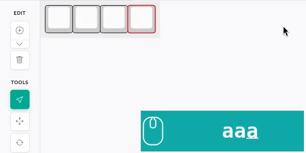

# kle-ng

The kle-ng is a reimplementation of the popular [Keyboard Layout Editor](http://www.keyboard-layout-editor.com)
designed to provide a better user experience while maintaining compatibility
with existing layouts.

The original [keyboard-layout-editor](https://github.com/ijprest/keyboard-layout-editor)
has remained largely unchanged since 2018 and shows its age in daily use.

## Why kle-ng?

Keyboard Layout Editor has been an essential tool for the mechanical keyboard DIY community,
enabling countless custom keyboard projects. However, as the community has grown and evolved,
the tool could benefit from improvements to better serve modern needs.

What's wrong with the original Keyboard Layout Editor?

- **Clunky interface**: Selection and editing tools feel outdated and imprecise
  - Limited mouse support
- **No updates**: Hasn't received meaningful improvements since 2018
  - Not responding to community feedback, not addressing bugs
- **Limited editing features**: Missing tools that would speed up layout creation

What kle-ng tries to do better:

- **Smoother Editing Experience**
  - Fast, responsive canvas-based rendering that handles large layouts effortlessly
  - Precise key selection and positioning with visual feedback
  - Intuitive drag-and-drop for moving keys around
- **Better Workflow**
  - Improved keyboard shortcuts for faster editing, better mouse support
  - Cleaner, more organized interface that gets out of your way
  - Extra tools for creating split layouts
  - Minor tweaks improving key rotation handling
- **Modern Features**
  - Better color picker with multiple format support
  - Improved visual feedback when editing keys
  - Dark theme

Watch this short demo to see it in action:

[kle-ng-corne-demo.webm](https://github.com/user-attachments/assets/11bee053-c40e-4803-a07c-5e7ea1a0aa73)

Future plans:

- **Import Ergogen layouts**: Direct integration with [ergogen](https://github.com/ergogen/ergogen) keyboard layouts
- **Advanced layout templates**: Add more pre-built templates for common keyboard layouts
- **Add more editing tools**

## Getting Started

The kle-ng runs in your web browser - no installation required.
Simply visit the application and start creating or editing your keyboard layouts.

For existing KLE users: Your saved layouts will work in kle-ng.
Just import your JSON files and continue where you left off.

## Features

### Selection Tool


Select keys with:
- Click to select a single key
- Use `Ctrl+[` and `Ctrl+]` to select previous/next key
- Click and drag to create a rectangle selection
- `Ctrl+Click` to add/remove keys from selection

Move selected keys using:
- Mouse middle (scroll) button click and drag
- Arrow keys for keyboard-based movement
- Select all, copy and paste with standard shortcuts (`Ctrl+A`, `Ctrl+C`, `Ctrl+V`)



Movement snaps to a configurable step size (defined in U, where 1U is the width of a standard key) which can be set in the canvas footer.


The 'Lock rotations' option determines how movement of rotated keys is handled:
- When **disabled**: The rotation origin (anchor) point remains stationary, and keys move in rotated coordinate space
- When **enabled**: The rotation origin moves with the keys, maintaining a fixed relative position between keys and their rotation anchor. Movement occurs in normal coordinate space


In this example, keys are moved using arrow keys, but the same behavior applies when moving with the mouse.

### Move Exactly Tool
For precise movement use 'Move Exactly' tool.


The 'Move Exactly' tool allows movement to any position, not limited to step size multiples.
It also supports movement in millimeters by defining the spacing (mm per U).

By default, spacing is set to 19.05 mm/U for both X and Y, which is typical value for
keyboards using Cherry MX style switches.
<br><br><br><br><br><br><br><br><br>

### Rotate Selection Tool
Rotate selection around anchor points (key corners and centers) using the 'Rotate Selection' tool.


### Mirror Tool
Create mirrored copies of selected keys by using 'Mirror Tool' and selecting a mirror axis position.
Supports both vertical (default) and horizontal mirroring, which can be selected from the tool dropdown.
The mirror axis position snaps to multiples of the step size.


### Image and SVG Label Support

Key labels support embedding images and SVG graphics, allowing for rich visual representation of icons, symbols, and custom graphics.

Images are aligned to the **inner keycap surface** (the top face of the key, excluding the border), not the outer key dimensions. This ensures precise visual placement on the visible key area.

**Load images from external url:**

<a href="http://editor.keyboard-tools.xyz/#share=NrDeCIENwLgdgL4BpwB4CWBbA5gAgM4BOAxgLwDkAFgC7UAO+MA9E4ZAO4B0261lArgCN++AKYkA9gDtqomZ2ITMTSABNImdviYBrADaiAtFOytRAM22VRa7Zkj5ZhJnSF70xJuuqQmH6dr6opx0JuS47OiqfKQAzABMuNbo2DRx8QB84AC62UA">
  
</a>

```json
[[{"a":7},""]]
```

- Image server must support CORS
- Tested formats: PNG, SVG

**Load images from the inline `<svg>`:**

<a href="http://editor.keyboard-tools.xyz/#share=NrDeCIENwLgdgL4BpwB4DOA3A5gAgO4CWAJgC4AWAvADrgDMATLbuQKaHbmk31Pi6ZCrfACEA9gA8eABlyzGuRswkBbADYA7dDy6kADjAD0h-KYB0+OmbEAnbIYbSnhrNloA+VAGNCNr2tZcLylaAEYANmYvAE8eCOYbOL5cADNCNTUeAGIAMRyAVjgGPkNPFxx3cABdKqA">
  
</a>

```json
[[{"a":7},"<svg width=\"32\" height=\"32\" viewBox=\"0 0 32 32\" xmlns=\"http://www.w3.org/2000/svg\"><circle cx=\"16\" cy=\"16\" r=\"12\" fill=\"#FF5722\"/></svg>"]]
```

- SVG must include explicit `width` and `height` attributes

## Compatibility

The kle-ng maintains compatibility with standard KLE JSON format for layouts.
However, **100% compatibility is not a goal**.
The following features are intentionally not supported:

- Different key profiles (appearance of keycaps). There is single default keycap rendering style.
- Full HTML content in key labels
  - Supports small subset of HTML tags: `<b>`, `<i>`, ``, and `<svg>`
- Background textures
- Legacy rendering quirks and edge cases

## Support

The best way to support this project is to:

- **Star this repository on GitHub** - It helps others discover the project
- **Use kle-ng share links** - When sharing your keyboard layouts, use kle-ng URLs. This helps spread awareness and grow the community

## Development

```bash
npm install
npm run dev
```
