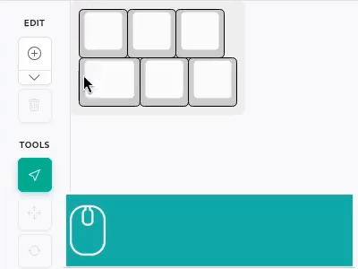

# kle-ng

The kle-ng is a reimplementation of the popular [Keyboard Layout Editor](http://www.keyboard-layout-editor.com)
designed to provide a better user experience while maintaining compatibility
with existing layouts.

The original [keyboard-layout-editor](https://github.com/ijprest/keyboard-layout-editor)
has remained largely unchanged since 2018 and shows its age in daily use.

## Why kle-ng?

Keyboard Layout Editor has been an essential tool for the mechanical keyboard DIY community,
enabling countless custom keyboard projects. However, as the community has grown and evolved,
the tool could benefit from improvements to better serve modern needs.

What's wrong with the original Keyboard Layout Editor?

- **Clunky interface**: Selection and editing tools feel outdated and imprecise
  - Limited mouse support
- **No updates**: Hasn't received meaningful improvements since 2018
  - Not responding to community feedback, not addressing bugs
- **Limited editing features**: Missing tools that would speed up layout creation

What kle-ng tries to do better:

- **Smoother Editing Experience**
  - Fast, responsive canvas-based rendering
  - Precise key selection and positioning with visual feedback
  - Intuitive mouse based drag-and-drop for moving keys around
- **Better Workflow**
  - Cleaner, more organized interface that gets out of your way
  - Improved keyboard shortcuts for faster editing, better mouse support
  - Extra tools for key [rotations](#rotate-selection-tool) and creating [split](#mirror-tool) layouts

## Getting Started

The kle-ng runs in your web browser - no installation required.
Simply visit the application and start creating or editing your keyboard layouts.

For existing KLE users: Your saved layouts will work in kle-ng.
Just import your JSON files and continue where you left off.

## Features

### Selection Tool



Select keys with:

- Click to select a single key
- Use `Ctrl+[` and `Ctrl+]` to select previous/next key
- Click and drag to create a rectangle selection
- `Ctrl+Click` to add/remove keys from selection

Move selected keys using:

- Mouse middle (scroll) button click and drag
- Arrow keys for keyboard-based movement
- Select all, copy and paste with standard shortcuts (`Ctrl+A`, `Ctrl+C`, `Ctrl+V`)


Movement snaps to a configurable step size (defined in U, where 1U is the width of a standard key) which can be set in the canvas footer.


The 'Lock rotations' option determines how movement of rotated keys is handled:

- When **disabled**: The rotation origin (anchor) point remains stationary, and keys move in rotated coordinate space
- When **enabled**: The rotation origin moves with the keys, maintaining a fixed relative position between keys and their rotation anchor. Movement occurs in normal coordinate space


In this example, keys are moved using arrow keys, but the same behavior applies when moving with the mouse.

### Move Exactly Tool

For precise movement use 'Move Exactly' tool.


The 'Move Exactly' tool allows movement to any position, not limited to step size multiples.
It also supports movement in millimeters by defining the spacing (mm per U).


By default, spacing is set to 19.05 mm/U for both X and Y, which is typical value for
keyboards using Cherry MX style switches.

### Rotate Selection Tool

Rotate selection around anchor points (key corners and centers) using the 'Rotate Selection' tool.


### Mirror Tool

Create mirrored copies of selected keys by using 'Mirror Tool' and selecting a mirror axis position.
Supports both vertical (default) and horizontal mirroring, which can be selected from the tool dropdown.
The mirror axis position snaps to multiples of the step size.


### Extra Tools

Extra tools are grouped under single button in the left side toolbar. Currently there are three:
1. **Legent Tools** - bulk legend editing
2. **Add Switch Matrix Coordinates** - assign [VIA style](https://www.caniusevia.com/docs/layouts/) row/column labels
3. **Move Rotatoin Origins** - recalculate positions according to new rotation references

#### Add Switch Matrix Coordinates Tool

This tool helps to map physical layout to the electrical switch matrix, enabling proper key mapping in
[VIA](https://www.caniusevia.com/) and [Vial](https://get.vial.today/) configurators which use special
flavour of KLE json layout with extra rules. To learn more see [VIA Documentation](https://www.caniusevia.com/docs/layouts/).


To start, click 'Extra Tools' button and select **Add Switch Matrix Coordinates** option.
If current layout has any key labels defined, you will be warned that proceeding will clear them up.
If accepted, you should get main tool window.

Window is divided in three sections:
- **progress indicator** - shows how many rows/columns current matrix has and how many keys are unassigned
- **actions** - user actions and mode toggle
- **instructions**

The kle-ng provides an algorithm which can handle annotations automatically.
It is recommended to start with **Annotate Automatically** option. If the results are not satisfactory
there is an option to edit the result. You can also clear everything with **Clear All Drawings**
and draw all row and columns manually.

An example of automatically annotated layout may look something like this:

<a href="http://localhost:5173/#share=NrBEAYBp1SMgjLeAmZUDM7IBZsFZsA2bAdmwA5sBObBGOKBJAXUmAG9QB3UALgQA6FPgC+cBNGSSkEyGjlY5eOYTkk55OVTm1IXXgMGkxc+qDace-ISfGgUUuI9kP5yR0rcq3atxrctNx0DG2FTNz03Zgt2UKMRewwnUGTXZIV4onCkyDV4oUS4ZL0CnOLEGBYWIA">
  
</a>

Blue wires represent rows and green wires represent columns. Top left key labels describe key position in the matrix.
To edit connections use appropriate editing mode:

<table>
  <tr>
    <th align="center" style="width:33%"><b>Draw Rows</b></th>
    <th align="center" style="width:33%"><b>Draw Columns</b></th>
    <th align="center" style="width:33%"><b>Remove</b></th>
  </tr>
  <tr>
    <td></td>
    <td></td>
    <td></td>
  </tr>
  <tr>
    <td colspan="2">
      <ul>
        <li>Left-click to start and complete segments</li>
        <li>Right-click or Escape to cancel</li>
        <li>Click existing wire to append/continue</li>
      </ul>
      New row/columns are assigned with first free numerical value.<br>
      It is possible to re-assign numbers later.
    </td>
    <td>Hover and click on a element to remove.</td>
  </tr>
</table>


To change a number of any row/column, hover over it in any editing mode and start typing number.
You should get renumbering prompt at the bottom of canvas area.

> [!NOTE]
> To export keyboard PNG image **with** row/columns wires overlay, open **Add Switch Matrix Coordinates** tool
> first and then use **Export**->**Download PNG**.

### Image and SVG Label Support

Key labels support embedding images and SVG graphics, allowing for rich visual representation of icons, symbols, and custom graphics.

Images are aligned to the **inner keycap surface** (the top face of the key, excluding the border), not the outer key dimensions. This ensures precise visual placement on the visible key area.

**Load images from external url:**

<a href="http://editor.keyboard-tools.xyz/#share=NrDeCIENwLgdgL4BpwB4CWBbA5gAgM4BOAxgLwDkAFgC7UAO+MA9E4ZAO4B0261lArgCN++AKYkA9gDtqomZ2ITMTSABNImdviYBrADaiAtFOytRAM22VRa7Zkj5ZhJnSF70xJuuqQmH6dr6opx0JuS47OiqfKQAzABMuNbo2DRx8QB84AC62UA">
  
</a>

```json
[[{"a":7},""]]
```

- Image server must support CORS
- Tested formats: PNG, SVG

**Load images from the inline `<svg>`:**

<a href="http://editor.keyboard-tools.xyz/#share=NrDeCIENwLgdgL4BpwB4DOA3A5gAgO4CWAJgC4AWAvADrgDMATLbuQKaHbmk31Pi6ZCrfACEA9gA8eABlyzGuRswkBbADYA7dDy6kADjAD0h-KYB0+OmbEAnbIYbSnhrNloA+VAGNCNr2tZcLylaAEYANmYvAE8eCOYbOL5cADNCNTUeAGIAMRyAVjgGPkNPFxx3cABdKqA">
  
</a>

```json
[[{"a":7},"<svg width=\"32\" height=\"32\" viewBox=\"0 0 32 32\" xmlns=\"http://www.w3.org/2000/svg\"><circle cx=\"16\" cy=\"16\" r=\"12\" fill=\"#FF5722\"/></svg>"]]
```

- SVG must include explicit `width` and `height` attributes

#### Backward compatibility

Original Keyboard Layout Editor supports two internal sets of icons which can be used as a labels:
- Font Awesome Icons ([fontawesome](https://fontawesome.com/) v4.4.0), for example `<i class='fa fa-github'></i>`
- Keyboard-Layout-Editor Icons (customized, probably derived from fontawesome), for example `<i class='kb kb-logo-windows-8'></i>`

This form of icons **is not supported** by Keyboard Layout Editor NG. This method limits the choice to predefined icons and theirs
appearance depends on the internal CSS definitions. Instead, kle-ng encourages to use inline SVGs which make the layouts self-contained.
See the example below:

<a href="https://editor.keyboard-tools.xyz/#share=NobwRAdg9gLgpgZzALjAHgIQFosYGJQQwAEAggO6JQC2cxeATnHQG4DsAdAIwcAMxAIwCexAAIAzQjACGlBDTpZiACxgwADgmQB6bZKKyqtDgGMaxADIBLE3AgJFKtZp16ph+cbPVtAGxt2DnpMdADCUOpCDFYA5qrEAEy8CQCs9FI2hAgANMQAkhAmHDgAfGAAvtmgYNIobJXoCCwxxAAe1L72ALwAOmCqGq7kwxzkAMwcUAwx2km8vNpNMX3E5FYAJjDKvWBjCSvKcLGqO3srLFZw5ABCUK07-PwALE8AHMQpXPtgJWjq0ltiOsdgBZBJJDgATmIXwmYxMXGIHDSPHePDYxDGMI4GJ4iP4CQ4rywHCeiShWB4aQ4CUppLpkKwhLGWAmtMJjPRJLYrIpXCwKWRJP5pKRtKJSJ5HAAbNjERwsTwscy5ZjReiAF4griQ6FfFIImnEAl0hKYum47gk2UTEVkiYpOmymkkp4k8WMmV0-k8aUkxkTYlewXUn0KpF+iZkqm8s0cpGIxMSqnktGkrVPJLEJ68QMmXl+t2CllcX1YTi0nU4unE15Wiac6VEym8IXg+lK71Mr2E-lujl0lnNwk8mNPK1myEuhKcLGCv0pceOiY8thTn08N1jVv8sadlJNt1PJuOtjjt1cTj8hIxsYrrBPHgBqPls1Cp6C6GCn17l1sQXElwv4lsk9J-k2aK5vSbCcHqYyCpWOKJC+h7ZqiTKEmk0rjqOdbQu2jofsiHx1sSKR1oikJNjysqXhSpGYk2-JNmaKRwlgJ4fM2pbqjhlJNrKEK0uOZrjiB4afpSGJ1mMCCUmSfpcHWKJLvmvZqoyhLvBR3ZooSZL8A2EbELB2JmjxaZmhR5IooKGIShCZFGlw54ClCiSuYSZq-higYmeGPHRq2aQQomKp0ViEyyjmDlISkU6KphMJTpBopjFOerjoiKSfjCrbRmWhKCXiWBToJklCTCmHCokTYsoKZJvAqHEyjC46ckad6tcWHzftm3DGeForjoJxHUb4-DcCYMkwtRyEOWJ2atsqioCYOmJZZSiJNSyM7uUBXpcKhYx+gkbIfK2AZef5R7EQdF47jCDaUjN9J1sJHazpSIZMlObBauCfmvLOJgpRhnUiUyqLZm6oqcS5nWtduFKLTFF5es2FWHUVD77VaPDeROSHPSN-WAeh048uuTJfV9QoHXqrbkw5LKbbSU5bvTrMdi1nolqTA43kSWpKbaJkAQij0EkzbXOeumIOryKLlgN1VcK2omtQTWB4byu07qVh1lTrorViliTa9DCTWfKaaerSuU-Vw87yYdwUCupdZFr2GrUJSUXENKrZsCYLG47RUUtrLPrBf1PLnk99MiYksGu2aV7GjC87ksquV4YH4ZZTCSr9WS7ayglxBe2qKIrsQf15Xd73drKV5bbL-YjjCOk8YikdVmikbvbLAYUn+lKG6dVrEorXwuur9JJN9JuFtxbIth2fHO81m649CvClf1lbMr7cIK08anE9+D5GWMrn-gFxIJBl33NtKdZ+ie5Zf0Lmn0nx+lKRdxxgkQ8E13QmEAZwZ0ik-Q9metrTggFuLUk0oZIUc1lKG0TOOZmiplq8lxOhKMyUvQZS4o6Oy9d6bxgRiWd418Qx5RNomTgNF3I22cn1CCFt9rSl8FWG085QZ3XIU8MWTVGqInflCX2dJ+yfnzJtNaxsDqKVcoI-y+JZbsmctRE2+FmosWNK7RknB+ztX9vTZuYwZKsmqrY5qewuZCi9lDfGdYeQJBGr9KEcldrsScQhEwCFwZ6g-g+BCKcXTxSNMyC0SJ3jr08YkJmJsURMSZAnNizUipV30hGJkwcKEPmhgdYk0oUxfBpmlWm7VMQJS2l3PEiT+o2iNMYouAskLWTmnPWiy0qrqgJMpahokCkEwLrSB0xc-x3UktCF+Ys6K1lau2EsaQ2GYnyokKhZ5wxjArPXKhTFZnRhmvBYiZ1WrYSRs1Aa9kgp42jIGVkdktrVn2eydirxLF8R8ZYtaON4Z5J4nGKc3k66XNYoYtEvo1QrSQmlKhR04YSkuXqUyyNfK4O7OKXcRoD7J3QZWA2CDoHgyfpkwRK9WR+giY4xKNCBqQyUgFABm5om7WTNrAO3jqwJ3SmPTZ1YA5KRau8Z+9jVYDjYHNZxnI6H+QSL7VI5iPkGn9LNZsj45YUmlOdY8LjzLvOfqKflR4+UhjkqA98zYuqjgSko6svduz9mWfWOqapRzJwhUyBiL8YrOkAlErk1tiKQ0cRiHGC8sRrTouZe8Qt5RDjfFKRUJJqRonOrOWqWsGJmpRHks+2KVZpEcReL1fMs7VncuXLilEOHEQzsjRUGddUDK1vClypDa5IX5dKEWbASEuU8ZA7E0IcL9TSO8DOAkuImuTK2QSuaF60XhQSaquVfyARlpY0Fl1yyy13aSBAkkvW2halPUan8G3OvtC6Bu6qGbUOJOYo+lIpwog1r4xmNI5JsvjsOSxf18yXq3dWU81YmwdUdLvJ84dcbcw6rDMMSSkLogLikDUfRtC-EWM0Mo2RwC1GQE8bIYBxAoHI2AcgKADr-go8oFACQKPrBQDABgABXOADQAASUByDEBgFAYgXGHDEH0DIOQChiCZHsMgNAAgGAlCUA4aQDATDKEk1MSTIQ5NmAgMQAEOmDAya8DQXIkhWjEDgK0aQ1B1C+DgMgJwGgtC6Ckx4BQpgaDaHkwgPwVgIBcdaAAfnEF0ZT0gIDrAQAAMgQF0eQ-h1hKZU0oMwkRiAAGUABqABxYg-xAQieE4cYTdmSBwHWFYETDBiBQHEMQIQUAuMNa01AAI6XVPGfWOsVYGxAQxYG4cY4JB1AMAiHABgMBLgIGIAACj2K0PYxWbPkCmAAa1WHAXwvgdMNa4AAVWIFtuAQgEAAEoeuZYiCIJgCAuO+BIGV87IhfDSAEHtyTlxfADcW+QDTEBgsxFc+QQ4Rmat1dB8QAAUjlgA8gAOSBFYJgJgYC+Ae3AWg1BvsNbK4gEw0h1B0GkPtoEbWBDOeIAARza-AYgWmNPSExzN67YAAC6VQSMoBSBRqjyAxgNGsCF1oPQIBoCWG0Do3Q+gDHUEMEY4xJjTFmPMBYSwVhrE2NsPo3iDhHDiDAHYhuwDEAuFcW49w+iPBhgwr4fRfgle08CPoYIIR6mufCeUKJkzE2xJabRWlXTklg2KeRDJuwsnXgOLkoq+RuUdFaU24p3i1togNAK4Yhp93VDiEWuoqoGkmSaSZJYMOp-aXaGuTpI9gQ9NaLsZYKSvODMRfG4YvQjqFOdeMA0kxphCgHp4GYsw5jzAWB8bkSxlgrJ+l1zYdIIIghvR07Z0aV+vD2K0-Y+T3KfkvwiE4xk1LnMGJchDyzU0CqyMl+5DwPi-vsi8bchbLnvLq580E3yEUdvjL+LSA-IBMBC2IAuBEui+DBPtNCgktcm6KhLqk-ElLcrhHWtVERGkORJjNZFRNBjCKnAxCdFaMYjkiyJxABB8tGFvPOkJLjJrOJBfpyNJAqABgpC9HdKpN2Pnn-NpETHpKKOgtCK1KZJMhZGZFXKrPMkipKmkqGq5LlBanipiJhn5KupygvCFI9HPG2gcq1DFJKnFJXHPCiObAvPaOQgjNlLlBYbMterwvyGVLshSJVKYTVLavVMNHYvOgjB1JCt1BJH1EXGsjno1KEVhDiBNAmNNAFHNNcpKqjIMmdNqopAcptKWNmHYntHBIdMdKdOdCkIes4unP-HdC+AvImAgq9G6M3Bol9NvBvn9ADAkVXCDGDO2N5JDELO8C8GHvDMnAHMjIyEkR2BjE5H-IpDjPUiVBXkTL5CjAYdxBTOyFTBOLTPcnBkZAvMzJKtzNeIbJzFsbjBeLzCSPzKEZpKiCLK8GLCAZLANNLMmMnFWH3IrDMvyBnGrBrG0mZAYnrEUlaKosbNXGbA5JbA5DbK0ghjEu5E7C7AjIpO7CkJ7PSCidwHImooHMHKHC6KTGolHNYevnHCcYnHBsnDkWnFopnNvKNLnE2tCF6kXDxFiAnPWpXNXB8XXA3Fod3NOKIfjDgovM0j3C0v3OYUPM5JYs9OPE4bvvyDPMyqSovAfM7LSrigdMqReFvMWFHvUgfJOvPCfNQCWnfJfL5NfOIu5HfNBD1OKmapyFQTIp-EKHKm2AhoAgAh2MAj2GAgfDSJAtBK1Hkc3tcv4SrMgiGkiGgnXpgkKPLAjHgo3LHhhsQuqMbOQj9FQl+kAvtGJC9A2snswjbGwrzFIUmIutIuCXwgIs4ZctKCImYe5FadtNXI+IHHhJiYvIorjMxGQodP3Bos4RnPwAjLouZPovnPEsYqqZYuqvypyLPDYnYs4suCuWrIrG4smpwV4j4g6f4kyIErHsEqEu2OEl6ERHGAvrEnGDvLIWqLSCko5OktqteNkuxHkq8AUj2MUj9MgYnBUlUqsbUs1PstCEKnPs0tnr0XcmaJ0iyqEawVWbiAegFBMiMsRBCtmBMh0i6B8YgjIYyIsm3oPkgivIkPEs7P5L5DsqkEhPspFEcpCCcoPpoRckwtcrKLcu0kOIiI8o3HqOqK8pcqOFyF8oec1L8osUBqvIyECl6CCl2nElhQ6piFEvFKmPYQivNPxSJdqgpOirYVisUjaUfvirGCYsSg+RvASiwT2KHraj6CCT3vSj3jNO4XPNtPPO5Ryual9FpLMtMmsv8mlC-M2onrRBUg5FdDKhSG6b5PHkqhWKqikM+lSPmHwjquIS-AakaEalsVwtWGamXK5FaeVMiDal-Lig6ovvCLjKJUTO6oPp6voT6kaH6uGu8IGsuokq-OZEVaMpGk+W7OGPGkcgxu4imu6JKOcTCJmtCTmrnr4QWl+kMjxdsp8sRBWvxOGNWtvFKPhHkn1OQqMi2oMnRNtN2j1TxLRNGKtQxh5DKEOiOk1CHP1YaRiEuFXNSfOqGgBI3CugFNdRuhRUKNuuhDsf1JMQJUeomRvE8GevqvoX2Q4cCneqSevE+h2EZGDO+qyvdT+g6Y3AkABp4rjE-CBjiGBkTJQpBirOwrBlHghgCs1JYrvF3uhpaBiCeDhmAHhmgARjEGUFzlzkAA">
  
  (Click to open in editor)
</a>

## Import/Export

### Supported Formats

kle-ng supports importing and exporting keyboard layouts in multiple formats:

**Standard KLE Format**

- Import and export layouts in the standard Keyboard Layout Editor JSON [format](https://github.com/ijprest/kle-serial)
- Compatible with layouts from keyboard-layout-editor.com
- Supports both raw array format and internal format with metadata

**PNG Format**

- Export layouts as PNG images with embedded layout data for documentation and sharing
- Import PNG files with embedded layout data to recover the editable layout

**VIA/Vial Format**

[VIA](https://www.caniusevia.com/) and [Vial](https://get.vial.today/) are keyboard configuration tools
that use a special JSON format.
VIA format is a JSON structure that wraps KLE data with additional metadata.
The `keymap` field contains standard KLE raw data (the layout), while the rest contains VIA-specific metadata.
On import, kle-ng converts VIA format to KLE format, preserving extra metadata in a special KLE-compatible
`_kleng_via_data` field.

<table>
<tr>
<td>Imported file</td>
<td>Import result</td>
</tr>
<tr>
<td>

```json
{
  "name": "Test VIA Layout",
  "vendorId": "0x1234",
  "productId": "0x5678",
  "matrix": {
    "rows": 2,
    "cols": 4
  },
  "layouts": {
    "keymap": [
      ["0,0", "0,1", "0,2", "0,3"],
      ["1,0", "1,1", "1,2", "1,3"]
    ]
  }
}
```

</td>
<td>

```json
[
  {
    "_kleng_via_data": "[compressed-base64-string]"
  },
  ["0,0", "0,1", "0,2", "0,3"],
  ["1,0", "1,1", "1,2", "1,3"]
]
```

<a href="http://editor.keyboard-tools.xyz/#share=NobwRA+g1gNgpgOwOYQG4EsCGEAmmAumYAXGAHIAsAkkjkgBZL5IAO6AQgMZUCCAjgFkAIgHkeADR7seZAIoApKgFEAYgJ4AtAMI8AKgHcAEgGd24nEp4BxejyGcAmvr2ck8gIwAPBwCUePBx4ABR4qZwBbHgFnAHURdH8RAHZOdAAGAHt2ACscFU8KHQAnO0Ck-woWAFUtEQQHdgAZADMkGHYATx4kviRdIQA2dAAOJHZ8ACNhzlkVAE4B3WMYcQBlVCQkgFcAVn8AXjAAXwAaYDA0k7SwE4uT9xu7gCZHy4BmMABdM7B3K8e-g9bn8XsCTh9Pp8gA">
  
</a>

(click to open in editor)

</td>
</tr>
</table>

This way, kle-ng maintains KLE format compatibility and also allows you to edit and reconstruct (export) the layout back to VIA format.
VIA metadata can be viewed and edited in the **Keyboard Metadata** panel under the **VIA Metadata** section.


At this moment, kle-ng does not validate the content of the **VIA Metadata** field.
It is the user's responsibility to maintain VIA format [specification](https://www.caniusevia.com/docs/specification).

Layouts which contain `_kleng_via_data` metadata can be exported back to VIA JSON format.
Exporting works by decompressing the `_kleng_via_data` field and injecting layout data back to the `layouts` value.

### Importing

kle-ng supports multiple ways to import keyboard layouts:

- **Import Dropdown**: Click the **Import** button in the toolbar and select:
  - **From File**: Browse for files on your computer
  - **From URL**: Enter any of the supported URL formats:
    - **Direct JSON URLs**: Any publicly accessible JSON file
    - **GitHub Gists URL**: Link to a gist with a layout file (see gist requirements below)
    - **Share Links**: Existing share links from other kle-ng instances
- **Drag and Drop**: Drag layout files directly onto the editor
- **Share Links**: Open layouts shared via URL (see Share Links section below):
  - **Universal URL format**: [https://editor.keyboard-tools.xyz/#url=https://gist.github.com/adamws/e0ee43da3b3b096bfdd60d54c7487e8b](https://editor.keyboard-tools.xyz/#url=https://gist.github.com/adamws/e0ee43da3b3b096bfdd60d54c7487e8b)
  - **Direct Gist ID**: [https://editor.keyboard-tools.xyz/#gist=e0ee43da3b3b096bfdd60d54c7487e8b](https://editor.keyboard-tools.xyz/#gist=e0ee43da3b3b096bfdd60d54c7487e8b)


Supported file formats: JSON (KLE format), PNG (with embedded layout data), VIA/Vial JSON

**Gist File Requirements:**

When importing from GitHub Gists, kle-ng will automatically search for layout files in this priority order:
  1. `layout.json`
  2. `keyboard.json`
  3. `kle.json`
  4. Any file containing "layout" or "keyboard" in the name
  5. Any `.json` file

The JSON file may contain any recognizable layout format.

**Note:** GitHub API has rate limits for unauthenticated requests. If you encounter rate limit errors, wait a few minutes before trying again.

#### Share Links

kle-ng provides a quick way to share your keyboard layouts with others using compressed URL share links.

**Creating a Share Link:**

1. Click the **Share Link** button in the toolbar (next to Import/Export)
2. The shareable link will be automatically copied to your clipboard
3. Share the link with others - they can open it to view your layout

The share link contains your entire layout encoded in the URL hash (e.g., [`#share=NrDeC...`](https://editor.keyboard-tools.xyz/#share=NrDeCICdwLgZgKwIDRQB6wIysgT1gCyoYwC024+ZR4AhrAAwC+q4AusmOCeS+O5wg9MfAV2GiOXaDAY4ScqFUUkKVUgwB0AJgSTB3LPvFHWUoaf7nDMbanUFjF205vbXJd2YMyakEnA4VHCaAOwolLCkjt7AVpzxcWIQMph+AZoAnJnhAGwEmPkMmXCh2UGwIQAcmDkIuXBwDIWNmQyBNuSa7QgExdlw2tm5CLUApqSh9lFa2XOZVQRVVdpVcLntrjLa6YRZuaFVCDkHCOuZxxUwBN25hYcEBNrahf3EUSEHL2dVuQuhaQYRwmVWmZEw3QYUOhy3qoVCfxEZjYQA)).
The layout data is compressed using LZ-String compression to create compact, shareable URLs.

## Custom Fonts

The original Keyboard Layout Editor provided [fine-grained](https://github.com/ijprest/keyboard-layout-editor/wiki/Custom-Styles)
control over keyboard CSS style via `css` metadata field defined in a layout.
This allowed to use any web font (like Google Fonts) for **any** label position
to display international characters, special symbols, or stylistic typography on keyboard render.
The kle-ng supports only a minimal subset of CSS specifically for loading fonts:

**Supported CSS syntax:**
- `@import url(...);` - Loads external font stylesheet (e.g., Google Fonts)

The font name is automatically extracted from the URL and applied globally to all canvas text.
It is not possible to define different fonts for different key labels.
All other CSS expressions are ignored and have no effect.

**Steps to add a custom font:**

1. Open the **Keyboard Metadata** panel
2. In the **CSS** field, add an `@import` statement with your font URL (from Google Fonts)
3. The font name will be automatically extracted from the URL and applied to the canvas rendering

Below image has been generated on a system **without** Japanese fonts installed:
<a href="http://editor.keyboard-tools.xyz/#share=NobwRAxgzlYFxgAIEsC2AHA9gJwC4AIBXbAGwAoALXXdKOAenoDNMA7XKAOgHNNNuSAUwCG6ZFwiZU9aFABMAfibDUyEgE8AvADlMuTAGoAysNZQDAKQAKASgDcYAL4AaUGGHwA7M7BN4AFhcwAFEoCDBncAAPeABGIIAxWIiwBLkUhIBmDP8I6PgABk4AVkTijIA2DM8MgA48sBi4ItKfBIBODNiCruS22PTIxsLOOWKfPzhMoKs8I3CfeexMEhJ8ABlMCABrBo84QJ8rYUIoQQAdVgAhbBFdgF1XcHUR8fd4N8m5IMApZUAlyPol0ARPaAdW1LuDWBDABaKfz2AQmASCAEJLrEIYAbBhS5zAlzkEMArgwpACll0yl0AggyXQBCDCkACSXfyXQCiDJdAGIMKQApJdipdAOIMl0AEgwpAB6lwql0AkgyXQBSDCkAGSXTyXQDBDJdACEMKQAVJdapdAKEMl0AYQwpMiXdqXQDhDJdABEMKRslwKl0ASQyXQDxDCkAPqXAC0EMA3gwpAyXTQQwAeDCkAD7g84QwA-DHC4J4goBqYnwV22UHQDSaRTGCKmQQAkmYUgAJKSCFJWbgAVSzjzcyngwGKjzAAHc4iUggAVYQAI3wgFPCBP+fOHMAARQhl0A+gwpADqM9YgDMGFLBCGAYQZLoARBhSACVl4BNBhSPeXgGkGFIATWXgGSGFI15eAKwYUoXl4BrBhSAHll4BIhiry6ANoMKQgJcwCXIAMAyXIA2QwpI4lz3JcgCwDJcgA5DNmIx5u8ib5m8nZwLEoxvBQ8ByD47bpARJQ+BQlGxD4USUd6uatCE7CCNg+CAHPEGHNER+bTD4AAiggkOurAACZVtwQmsGADbgE2cAtm2+GEZ4rEAMKiFAGxbNsgCPQYADqajuOQQAILLoAhgwpEYy6ABYMKRCcugDqDBky6APYMKQAOLLoAsgxlsugDyDCkFjLoAfgwpAA0sugB2DCk6zLoAUQwpHAlx2BCgAxDCkiCXAA5BCgCKDCkAB+lwAMQQoAAQzyU82HeB2XZjEEgDnhPgRgUMgTC4KOQRRpCMaQqw8Y+AAWsugAmDCkAAay6AKoMKSacugC6DCkABqy6AE4MKRXMugDKDCk2jLoA-gwpAAssugBBDCkAA8lzOBCgC2DCkAB8lycBCgDRDCkCiXICQ2AIEMKQADWXAABhCgCxDAmDVqZwGmte1nXdbxhFYZMrGAE2ktWNvCjVUc1PiabgpApEwclDBjQSAGrkDSTBO5kkD1lPwIJYCAISOgCQmoA28YJgU5EBN2Pgw0EPMJp8pECwTrGANUMgD9DDLgBTDJcgC3DLGgB7DGCQ1bb+gAyDC+Qz7A19MWUz3nYHTHxBIAJaSWwcQTE6TQw5vxvhWz4gADpCkgA9pCkgBtpPJ9xAA">
  
</a>


**Notes:**
- This allows to use fonts not installed on the system
- Custom fonts only affect the canvas rendering and exported PNG images - they don't change the UI font
- Font settings are embedded in the layout's CSS metadata, making your layouts portable and shareable

## Compatibility

The kle-ng maintains compatibility with standard KLE JSON format for layouts.
However, **100% compatibility is not a goal**.
Same layout files might render slightly differently on [keyboard-layout-editor](https://www.keyboard-layout-editor.com/) and [kle-ng](https://editor.keyboard-tools.xyz/).
The following features are intentionally not supported:

- Different key profiles (appearance of keycaps). There is single default keycap rendering style.
- Full HTML content in key labels
  - Supports small subset of HTML tags: `<b>`, `<i>`, ``, and `<svg>`
- Background textures, highly customizable CSS label styling
  - kle-ng provides [minimal `css` metadata support](#custom-fonts)
- Legacy rendering quirks and edge cases

The kle-ng uses for or [kle-serial](https://github.com/adamws/kle-serial2) fork which in version v0.18.0
introduced new KLE property type (`'ta'`) as a solution for color handling problems from
the original editor ([#344](https://github.com/ijprest/keyboard-layout-editor/issues/344), [#334](https://github.com/ijprest/keyboard-layout-editor/issues/334), [#315](https://github.com/ijprest/keyboard-layout-editor/issues/315) and [#214](https://github.com/ijprest/keyboard-layout-editor/issues/214)).
This property follow same semantics as text size equivalent property (`'fa'`).
Layouts using `'ta'` can be opened with legacy editor but it will render font colors differently.

## Support

The best way to support this project is to:

- **Star this repository on GitHub** - It helps others discover the project
- **Use kle-ng share links** - When sharing your keyboard layouts, use kle-ng URLs. This helps spread awareness and grow the community

## Development

```bash
npm install
npm run dev
```
